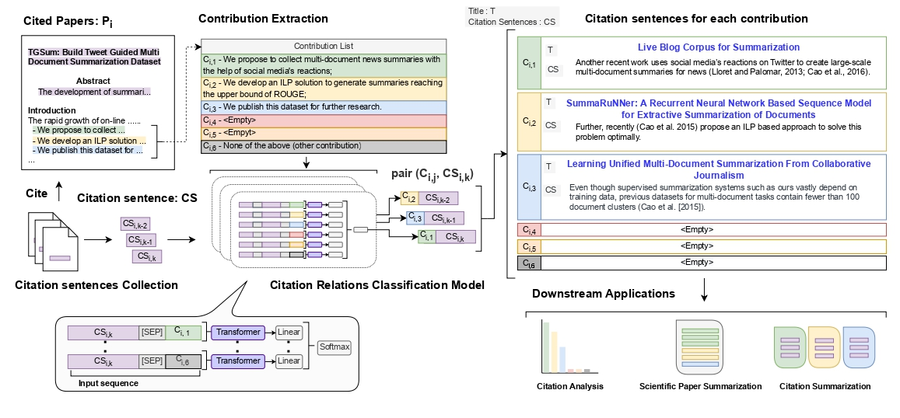
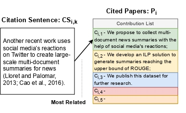

# C2RC2: Categorizing Citation Relations in Scientific Papers Based on the Contributions of Cited Papers

# Introduction

With the massive increase in the number of research papers, it becomes difficult for researchers to keep track of the current state of research. 
Unlike the current classification methods that use citation intent, from a reverse perspective, we propose a method to Classify Citation Relationships based on the Contributions of Cited papers.
This classification method can count the number of citations for each contribution, which can be used as a feature of a paper summarization system to generate a summary. Since the number of citations changes over time, the generated paper summary is dynamic.
It can also generate a citation summary based on the citations of each contribution. 
We build a dataset for this method called C2RC2. 
We achieve an accuracy of 0.7896 on the test set using the SciBERT model, which indicates that it is feasible to classify citation relations by the contributions of cited papers.

# C2RC2 Dataset

A dataset called C2RC2 is proposed in this paper. We collect cited papers and citation sentences on the Internet, then convert them to the format shown as following.

# How to Cite the Dataset

Please cite the following paper if you use this dataset:

Po-Chun Chen, Hen-Hsen Huang and Hsin-Hsi Chen (2022). “Categorizing Citation Relations in Scientific Papers Based on the Contributions of Cited Papers.” In Proceedings of the 21st IEEE/WIC/ACM International Conference on Web Intelligence and Intelligent Agent Technology, November 17-20, Niagara Falls, Canada.

